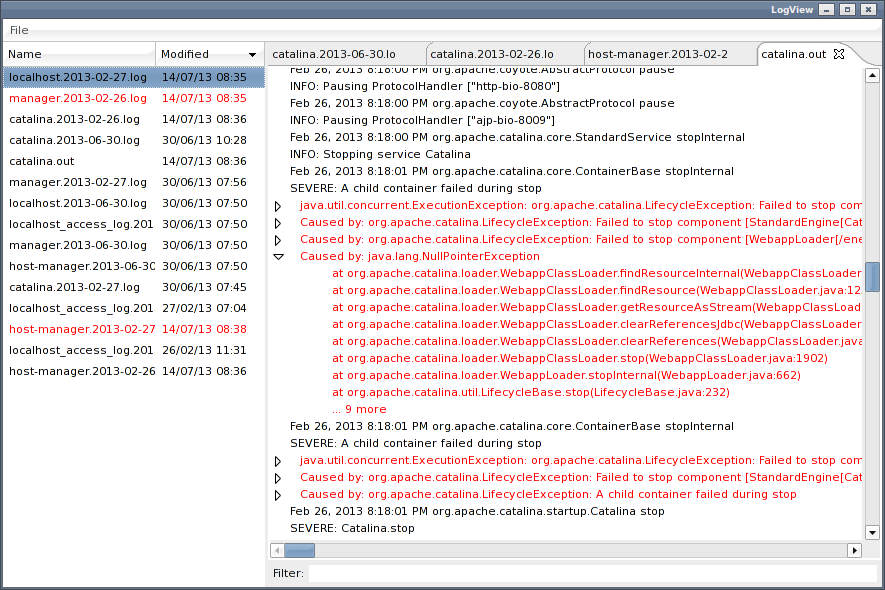

LogView
=======

A simple swt based log viewer for monitoring multiple files.

Features
--------

* Tabbed and list view to monitor multiple files.
* Highlighting of modified files.
* Automatic scrolling of new content if the textview is scrolled to the bottom.
* Text filtering.
* Expanders for collapsable content based on indentation, such as stacktraces.

Installation
------------
* Replace lib/swt.jar with your platform specific library from: from http://www.eclipse.org/swt/.

* Build with ant:

        ant jar
    
Usage
-----

    java -jar logview.jar [files...]
